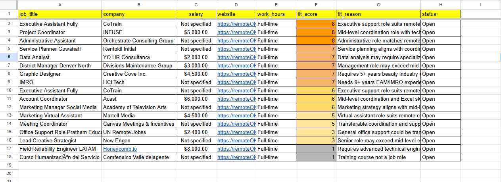

# CV-to-Remote-Job Matching - Documented Workflow Prototype

An automation case study documenting an n8n prototype that processes CV information, searches a remote-job source, assigns a 1-10 fit score, organizes results in Google Sheets, and prepares an alert summary.

## Status

**Documented Workflow Prototype / Automation Case Study**

This repository contains privacy-reviewed screenshots and documentation. It does **not** currently contain an exportable n8n workflow JSON or downloadable sample workbook, so it should not be treated as a reproducible completed automation.

## Prototype flow

```text
CV input
  -> extract target role and keywords
  -> request remote-job listings
  -> clean and limit results
  -> score jobs against the candidate profile
  -> organize selected fields in Google Sheets
  -> prepare an alert summary
```

## Documented capabilities

- CV keyword and role extraction concept
- HTTP request to a remote-job source
- Job-list cleaning and limiting
- 1-10 suitability scoring concept
- Structured spreadsheet output
- Alert-summary step

These capabilities are visible in the prototype screenshots. Credentials, identifiers, personal CV data, and private endpoints are not included.

## Screenshots

### Prototype overview


The overview shows the planned sequence from CV input through job collection, scoring, spreadsheet storage, and an alert step.

### Sanitized job-results example



The example sheet shows fields such as job title, company, salary when available, source link, work hours, fit score, fit reason, and status. It is included as visual evidence only, not as a downloadable workbook.

## Tools explored

- n8n
- HTTP requests
- AI-assisted information extraction and scoring
- Google Sheets
- Telegram alert concept

## Privacy and security

- No API keys, tokens, webhook URLs, Telegram chat IDs, spreadsheet IDs, personal CV data, or private endpoints are published.
- A previous Telegram screenshot was removed because it exposed a Google Sheets document identifier.
- Screenshots are kept only when they support the case study without exposing credentials or personal records.

## Next step

A future reproducible release should include a genuinely exported and sanitized n8n workflow plus generated sample data. Those files should be added only after every credential and personal identifier has been removed and the workflow has been tested from a clean import.
