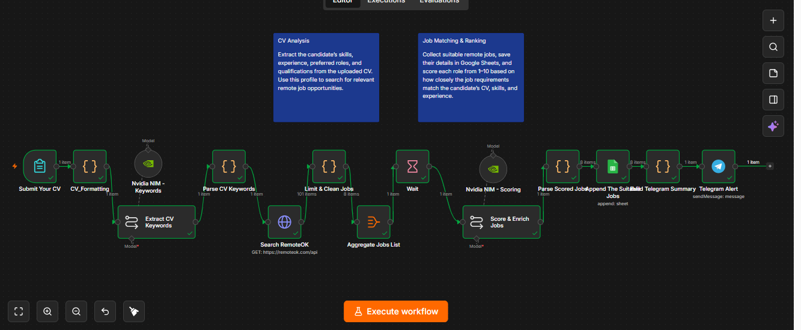
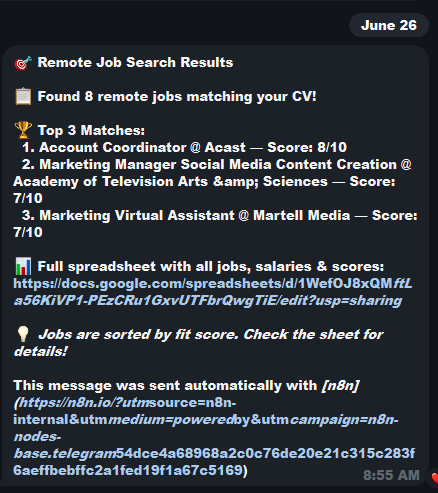

# CV-to-Remote-Job Matching Workflow

> An n8n automation that analyzes a CV, finds suitable remote-job opportunities, scores each role from **1–10** based on fit, saves the results to Google Sheets, and sends Telegram alerts for strong matches.

## Project Overview

Searching for remote jobs manually can be time-consuming, especially when it is difficult to tell which roles genuinely match a candidate's skills and experience.

This project turns a CV into a structured job-search workflow. It extracts key information from the CV, searches for relevant remote opportunities, organizes the results in a spreadsheet, and assigns each job a suitability score. This helps the candidate focus on the opportunities most aligned with their profile.

## What the Workflow Does

1. Receives CV text as input.
2. Extracts the candidate's target role, skills, experience level, years of experience, and relevant industries.
3. Searches for remote jobs related to the extracted profile.
4. Collects and organizes useful job details.
5. Evaluates how suitable each job is for the candidate on a scale from **1 to 10**.
6. Adds the ranked results to a Google Sheets job-tracking table.
7. Sends a Telegram notification when suitable job opportunities are found.

## Workflow Logic

```text
CV Input
   ↓
AI extracts candidate profile
   ↓
Search for relevant remote jobs
   ↓
Clean and structure job details
   ↓
Score each job against the CV
   ↓
Save ranked results to Google Sheets
   ↓
Send Telegram job alert
```

## Job Tracking Sheet

The Google Sheets output can include fields such as:

- Job title
- Company
- Job link
- Job category / niche
- Salary, when available
- Working hours, when available
- Application status
- Application date
- Match notes
- Suitability score (1–10)

## Tools Used

- **n8n** — workflow automation and node orchestration
- **AI model via API** — CV analysis and job-fit scoring
- **Google Sheets** — job database and result tracking
- **Telegram** — job-alert notifications
- **Remote-job sources / HTTP requests** — job discovery and data collection

## Screenshots

### 1. Workflow Overview



This visual shows the full n8n workflow, including CV processing, job collection, scoring, Google Sheets storage, and the alert path.

### 2. Ranked Job Results Sheet


The output sheet organizes discovered remote jobs and gives each opportunity a suitability score to make the strongest matches easier to prioritize.

### 3. Telegram Job Alert



Telegram notifications provide a quick update when the workflow finds suitable remote-job opportunities.

## Skills Demonstrated

- Workflow automation with n8n
- AI prompt design
- CV information extraction
- Job-data collection and transformation
- API and HTTP-request integration
- Google Sheets automation
- Data organization and tracking
- Job-to-CV suitability scoring
- Telegram notification automation

## Why This Project Matters

This workflow solves a practical job-search problem: it converts unstructured CV information into a structured, prioritized list of remote opportunities. Instead of manually reviewing every job, the candidate receives an organized sheet with a clear match score for each role.

## Repository Structure

```text
CV-Remote-Job-Matching-Workflow/
│
├── README.md
│
├── workflow/
│   └── cv-remote-job-matching-workflow.json
│
├── screenshots/
│   ├── 01_job_results_sheet.png
│   ├── 02_telegram_job_alert.png
│   └── 03_workflow_overview.png
│
└── sample-output/
    └── sample-matched-jobs.xlsx
```

## Privacy Note

This repository should contain sample or anonymized data only. Do not upload personal CVs, private job-search information, API keys, bot tokens, or credentials.

---

**Built as a portfolio project by Ahmed Tarek.**
